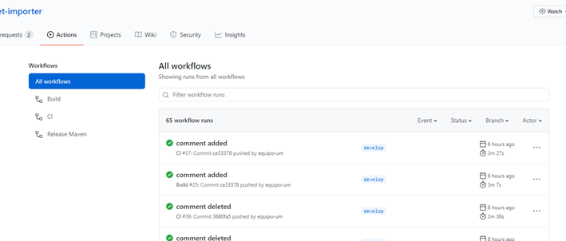
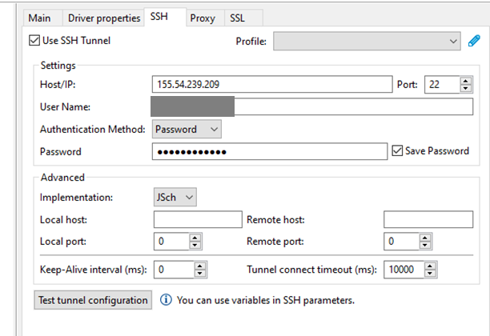
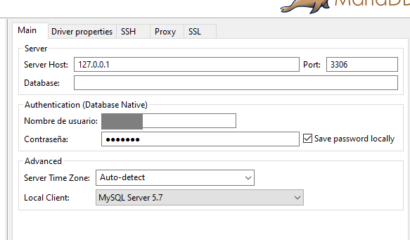
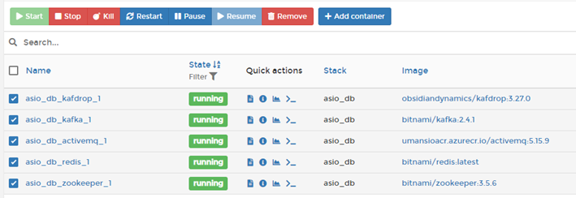
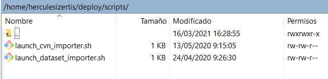
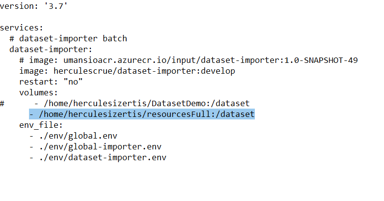
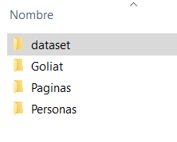
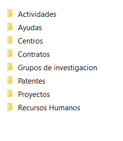
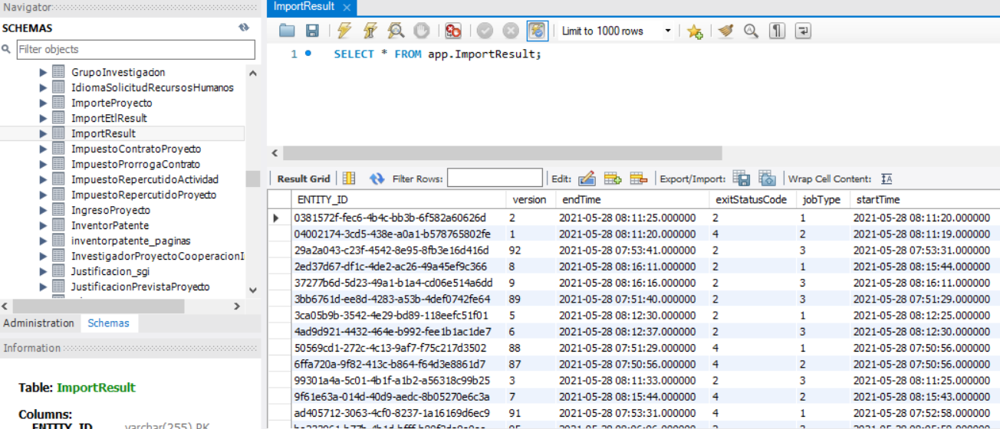

| Entregable     | Manual ejecución de importadores        |
| -------------- | ------------------------------------------------------------ |
| Fecha          | 27/05/2021                                                   |
| Revisado por   | Paloma Terán Pérez                                           |
| Proyecto       | [ASIO](https://www.um.es/web/hercules/proyectos/asio) (Arquitectura Semántica e Infraestructura Ontológica) en el marco de la iniciativa [Hércules](https://www.um.es/web/hercules/) para la Semántica de Datos de Investigación de Universidades que forma parte de [CRUE-TIC](https://www.crue.org/proyecto/hercules/) |
| Módulo         | Importador base                                              |
| Tipo           | Software                                                     |
| Objetivo       | Manual ejecución importadores. |
| Estado         | **100%**  |

# Manual para lanzar el importador


Se debe revisar la documentación del fichero [README](./README.md) del proyecto, ya que en este se encuentran los jobs configurados disponibles y los parámetros de configuración del proyecto, entre otra información muy importante. 


## Introduccion

Las aplicaciones se despliegan mediante imágenes de Docker generadas a partir del código. Una vez subidos los cambios debemos acceder a los repositorios de Murcia (https://github.com/HerculesCRUE/ib-dataset-importer/actions), y comprobar en el repositorio, en la pestaña Actions, que se han completado las acciones CI y Build correctamente.



 

Si las operaciones se han completado correctamente, se habrá generado una nueva imagen en DockerHub, que será la que se procederá a desplegar.

Para desplegar una imagen, deberemos acceder a la ruta en la que se encuentra su fichero docker-compose asociado. En todos los servidores, estos se encuentran en la siguiente ruta:

**/home/herculesizertis/deploy**


Es probable que algunas imágenes tengan sus ficheros en subcarpetas de este directorio (Nginx, por ejemplo, en la carpeta gateway).

Para actualizar las imágenes debemos ejecutar la siguiente secuencia de comandos:

·    docker-compose down -> Para las imágenes configuradas dentro del fichero.

·    docker-compose pull -> Descarga las imágenes que necesiten actualizarse.

·    docker-compose up -d -> Levanta las imágenes configuradas dentro del fichero.

**NOTA**: El comando docker-compose coge el fichero por defecto docker-compose.yml. Si queremos especificar un fichero distinto deberemos utilizar le propiedad -f [nombre_del_fichero], utilizando dicha propiedad tantas veces como ficheros queramos utilizar.

**NOTA IMPORTANTE**: A la hora de desplegar imágenes en los servidores que albergan los frontales (como la app o el trellis), es necesario reiniciar el Nginx, ya sea mediante docker-compose o desde el Portainer correspondiente. Si no se hace eso, algunas cosas quedan inaccesibles, ya que el Nginx para perder la referencia a los upstreams que tiene configurados.


## Lanzar el proceso de importación

Para lanzar el proceso de importación es necesario asegurarse de que ciertas condiciones se cumplan.

### Bases de datos

Para conectarnos a la base de datos tenemos que configurar un túnel SSH con los datos del servidor especificados más arriba:



Y luego realizando la conexión a través de la IP local:



 

**NOTA**: La cuenta de acceso se puede obtener del fichero de docker-compose en el que se configura el servidor de base de datos.

Para el proceso de importación es necesario que estén creadas las siguientes bases de datos:

·    cvn

·    etl

·    input

·    master

·    uris


**NOTA IMPORTANTE**: Crear las bases de datos con la codificación UTF8, excepto cvn que tiene que estar creada con la codificación utf8mb4.

Algunas de estas bases de datos puede que nos las proporcione Nacho, así que es conveniente revisar que los scripts utilicen la codificación correcta para crear las tablas.

La base de datos de uris genera sus tablas al arrancar el contenedor del uris-generator.

 

### Colas Kafka

Para que las colas Kafka estén activas basta con tener las imágenes activas en los servidores de BBDD mencionados al principio del documento. Pero existe la posibilidad de que las colas dejen de funcionar tras un uso intensivo por lo que será necesario reiniciar las imágenes. Para solucionar esto recomendamos parar los siguientes contenedores:



 

No recomiendo hacerlo con el docker-compose porque en él se encuentra también el contenedor con las bases de datos y podríamos provocar la pérdida de datos con los siguientes pasos.

 

Una vez parados los contenedores, ejecutamos los siguientes comandos para limpiar y relanzarlos:

·    docker container prune -f

·    docker volumen prune -f

·    docker-compose -f docker-compose.yml -f docker-compose-redis.yml up -d

 

Si fuese necesario limpiar los datos de Fuseki, lo incluiríamos en el listado de contenedores anterior. En este caso habría que reiniciar el contenedor de Trellis también.

 

### Lanzamiento de procesos

La primera parte del proceso de importación consiste en la ejecución de diversos scripts que se encargan de procesar los datos de entrada. Estos scripts se encuentran en la siguiente ruta en los servidores que contienen los importadores:

**/home/herculesizertis/deploy/scripts**





Al lanzar los scripts se lanzan los contenedores correspondientes, que se encargarán de procesar los datos de entrada. Dichos datos de entrada se encuentran en la ruta especificada en el volumen en el docker-compose correspondiente. 

La ejecución de estos scripts afecta a los contenedores que estos crean y el contenedor del input-processor. Consultando los logs de estos contenedores podemos comprobar que el proceso se ejecuta correctamente.

 

Tras la finalización de la ejecución de estos scripts, se procede a la ejecución de la parte de la ETL. Este proceso afecta a los contenedores siguientes:

·    Pentaho

·    Management system

·    Uris generator

·    Event processor

·    Triples storage adaptorç


Previo al lanzamiento del proceso debemos asegurarnos que las bases de datos estén correctamente cargadas (comprobando que las codificaciones sean correctas). Una vez comprobadas las bases de datos, tenemos que cargar la última versión (si no está cargada ya) del proyecto de Pentaho.


### Ficheros del Dataset


Los ficheros XML se deben subir a la ruta ***/home/herculesizertis/resourcesFull*** configurada en el fichero ***/home/herculesizertis/deploy/docker-compose-import-dataset.yml***:



Los ficheros XML deben de seguir el siguiente orden de carpetas, pero no hace falta que se importen todos los xml en cada importación.



La carpeta dataset contendrá la siguiente estructura:


El listado de documentos debe de seguir la siguiente estructura:

```


+---dataset

| +---Actividades

| | Actividades.xml

| | Facturas emitidas actividades.xml

| | Grupos actividades proyectos.xml

| | Grupos actividades.xml

| | Impuestos repercutidos actividades.xml

| | Tipos actividades.xml

| |

| +---Ayudas

| | Amortizaciones financiacion registros ayudas definitivas.xml

| | Anualidades financiacion registros ayudas definitivas.xml

| | Convocatorias ayudas.xml

| | Desglose gastos registro ayudas definitivas.xml

| | Desglose gastos registro ayudas provisionales.xml

| | Desglose gastos solicitudes ayuda.xml

| | Entidades colaboradoras solicitudes ayudas.xml

| | Equipos solicitudes ayuda.xml

| | Financiacion registros ayudas definitivas.xml

| | Financiacion unidades ayudas.xml

| | Fuentes unidades ayuda.xml

| | Partidas convocatorias.xml

| | Referencias unesco solicitudes ayuda.xml

| | Registro ayudas provisionales.xml

| | Registros ayudas definitivas.xml

| | Solicitudes ayudas.xml

| | Subprogramas ayudas.xml

| | Tipos ayudas.xml

| | Tipos gastos unidades ayudas.xml

| | Unidades ayudas.xml

| | Unidades gestoras unidades ayudas.xml

| |

| +---Centros

| | Centros.xml

| | Departamentos.xml

| |

| +---Contratos

| | Anualidades contratos proyectos.xml

| | Contratos proyectos.xml

| | Desglose gastos contratos proyectos.xml

| | Desglose gastos prorrogas contratos.xml

| | Equipos contratos proyectos.xml

| | Impuestos contratos proyectos.xml

| | Impuestos prorrogas contratos.xml

| | Patentes contratos proyectos.xml

| | Prorrogas contratos proyectos.xml

| |

| +---Grupos de investigacion

| | Conceptos grupos.xml

| | Conceptos investigadores.xml

| | Datos contacto grupos.xml

| | Datos equipo investigacion.xml

| | Grupos de investigacion.xml

| | Tipo participacion grupo.xml

| |

| +---Patentes

| | Costes patentes.xml

| | Empresas explotan patentes.xml

| | Empresas titulares patentes.xml

| | Inventores patentes.xml

| | Patentes.xml

| | Protecciones patentes.xml

| | Sectores industriales patentes.xml

| |

| +---Proyectos

| | Anualidades proyectos.xml

| | Datos anualidades proyectos.xml

| | Dependencias proyectos.xml

| | Equipos proyectos.xml

| | Facturas emitir proyectos.xml

| | Facturas proyectos.xml

| | Fechas equipos proyectos.xml

| | Fechas proyectos.xml

| | Financiacion proyectos.xml

| | Gastos previstos proyectos.xml

| | Gastos proyectos.xml

| | Importes proyectos.xml

| | Impuestos repercutidos proyectos.xml

| | Ingresos proyectos.xml

| | Justificaciones previstas proyectos.xml

| | Origenes proyectos.xml

| | Proyectos dependencias proyectos.xml

| | Proyectos.xml

| | Relaciones origenes proyectos.xml

| | Tipos actividades.xml

| | Tipos auditorias proyectos.xml

| | Tipos financiacion.xml

| | Tipos fuentes financiacion.xml

| | Tipos gastos genericos.xml

| | Tipos ingresos genericos.xml

| | Tipos motivos cambios fechas.xml

| | Tipos origenes proyectos.xml

| | Tipos rechazos justificacion.xml

| |

| \---Recursos Humanos

| Convocatorias recursos humanos.xml

| Idiomas solicitudes recursos humanos.xml

| Meritos solicitudes recursos humanos.xml

| Registro recurso humano concedido.xml

| Registro recurso humano provisional.xml

| Solicitudes recurso humano concendido.xml

| Solicitudes recursos humanos.xml

| Solicitudes registro recurso humano provisional.xml

| Subprogramas recursos humanos.xml

| Tipos recursos humanos.xml

| Unidades recursos humanos.xml

|

+---Goliat

| Dedicacion investigador.xml

| No laborables.xml

| Timesheets.xml

| Work descriptions.xml

| Work logs.xml

| Work packages.xml

|

+---Paginas

| Alegaciones.xml

| Articulos.xml

| Articulos2.xml

| Autores articulos.xml

| Autores captitulos libros.xml

| Autores congresos.xml

| Autores diseos.xml

| Autores exposicion.xml

| Autores exposiciones.xml

| Autores libros.xml

| Autores prologo libros.xml

| Ayudas iniciacion.xml

| Ayudas postdoctorales.xml

| Capitulos libros.xml

| Comite congresos.xml

| Comite editorial.xml

| Congresos.xml

| Congresos2.xml

| Contratos postdoctorales.xml

| Convocatorias.xml

| Diploma estudios avanzados externo.xml

| Diploma estudios avanzados.xml

| Directores contratos postdoctorales.xml

| Directores diploma estudios avanzados externo.xml

| Directores diploma estudios avanzados.xml

| Directores tesinas externas.xml

| Directores tesis externas.xml

| Diseos.xml

| Editores libros.xml

| Empresas explota patentes.xml

| Estancias breves.xml

| Estancias.xml

| Exposiciones.xml

| Inventores patentes.xml

| Investigadores proyectos cooperacion internacional.xml

| Libros.xml

| Miembros comite congresos.xml

| Paises patentes.xml

| Palabras clave articulos.xml

| Palabras clave comite congresos.xml

| Palabras clave congresos.xml

| Palabras clave libros.xml

| Palabras clave prologo libros.xml

| Patentes.xml

| Prologo libros.xml

| Proyectos cooperacion internacional.xml

| Requisitos contratos postdoctorales.xml

| Solicitudes cambios grupos investigacion.xml

| Tesinas externas.xml

| Tesis dirigidas UMU no registradas.xml

| Tesis externas.xml

|

\---Personas

Personas.xml
```


**Comprobación**


Para finalizar la importación se debe comprobar la bbdd, la tabla ImportResults contiene el resultado de los jobs, donde los valores de jobType corresponden con:

1- Dataset

2- CVN

3- OAIPMH


Y los valores de exitStatusCode corresponden con:


0-Unknown

1- Executing

2- Completed

3- Noop

4- Failed

5- Stoped


De esta forma si el importador de Datasets finaliza correctamente, la tabla ImportResult tendrá una fila con valores exitStatusCode 2 y jobType 1.

